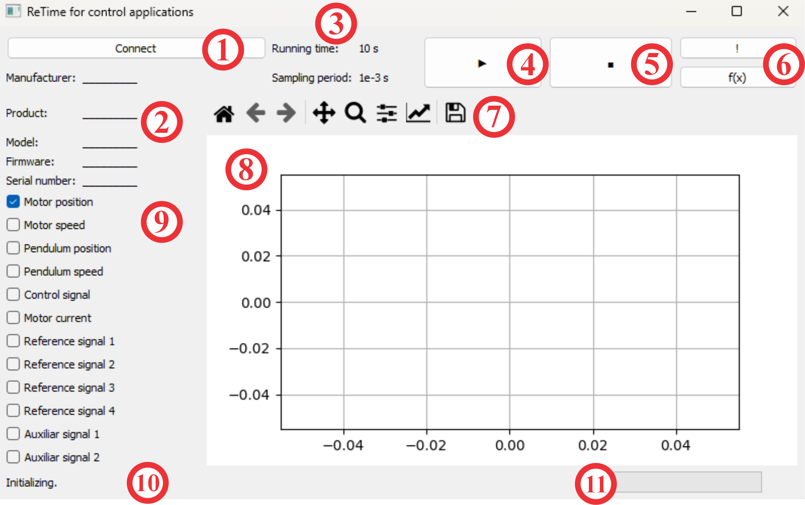

# ReTime_CA

## An open-source Python-based tool for real-time control applications.

**You can download the application paper [here](https://revistadigital.amca.mx/a-python-based-open-source-software-for-real-time-control-systems/)**

Such paper introduces this open-source Python software, which achieves a high performance for the sampled period (high runing in a PC), despite running on a general-purpose operating system instead of a real-time operating system. The software is designed to implement control systems and experiment with physical platforms, particularly the Quanser Qube-Servo 2 (It is a free aporach to use this plataform). This article describes the coding design, numerical methods, modeling, and identification of the Qube-Servo 2, the control design, and its implementation. Finally, a quick guide to downloading via GitHub and installation requirements are provided.

The GUI are already detailed:

1. Connection Button: This interactive element initiates the connection process between the interface and the Qube-Servo 2 platform. Upon successful connection, the platform's specifications are displayed, and its status color changes from red to blue. 
2. Platform Information and Specifications: This section provides the technical specifications of the connected platform.
3. Running Time and Sampled Period: These labels display the total running time of the current experiment and the period at which data is sampled, respectively.
4. Run Button: This control initiates the execution of experiments on the connected platform, if available. Otherwise, a simulation can be executed.
5. Stop Button: This control interrupts the currently running experiment and stops the platform, allowing users to end their experiment at any time.
6. Additional Function Buttons: These controls provide access to the sampling time information and execute an additional user-defined function. 
7. Data Visualization Toolbar: This control panel, powered by Matplotlib, provides various tools for manipulating the data visualization, such as zooming, panning, and saving the current view. 
8. Data Visualization Panel: This is the main area where the data from the real-time experiments is plotted after the execution. 
9. Signal Selector: These checkboxes allow users to select which signals are displayed on the Data Visualization Panel. 
10. Status Bar: This section displays the software and connected platform's status, warnings, and errors.
11. Progress Bar: This indicator visually represents the progress of the current experiment.
